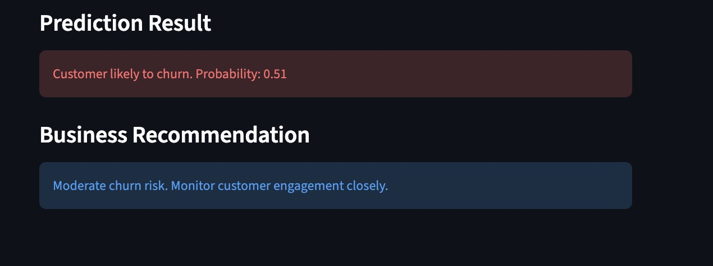
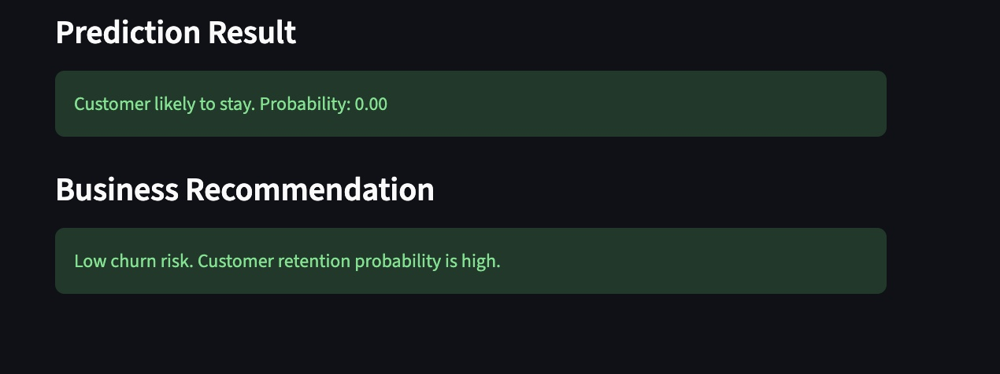

# Customer Intelligence & Churn Prediction Platform

An end-to-end machine learning and analytics platform designed to predict customer churn and generate actionable business insights for telecom retention strategies.

---

# Business Problem

Customer churn is one of the biggest revenue challenges for telecom companies. Retaining existing customers is significantly more cost-effective than acquiring new ones.

This project analyzes customer behavior, identifies churn drivers, and deploys a real-time churn prediction system to support proactive retention strategies.

---

# Project Features

- Data cleaning and preprocessing
- Exploratory Data Analysis (EDA)
- Business insight generation
- Feature engineering
- Logistic Regression and Random Forest modeling
- Model evaluation using Recall, F1-score, ROC-AUC
- Feature importance analysis
- Streamlit web application deployment
- Real-time churn prediction
- Business recommendation engine

---

# Tech Stack

- Python
- Pandas
- NumPy
- Scikit-learn
- Seaborn
- Matplotlib
- Streamlit
- Git & GitHub

---

# Project Workflow

1. Data Cleaning
2. Exploratory Data Analysis
3. Feature Engineering
4. Machine Learning Modeling
5. Model Evaluation
6. Feature Importance Analysis
7. Streamlit Deployment

---

# Key Business Insights

- Customers with lower tenure show significantly higher churn probability.
- Month-to-month contracts exhibit higher churn behavior.
- Higher monthly charges are associated with increased churn risk.
- Contract type and tenure emerged as major churn drivers.

---

# Model Performance

## Logistic Regression
- Accuracy: ~80%
- ROC-AUC: ~0.83
- Strong baseline with good interpretability

## Random Forest
- Captured nonlinear relationships and feature interactions
- Used for feature importance analysis

---

# Top Churn Drivers

- TotalCharges
- MonthlyCharges
- tenure
- Contract Type
- Payment Method

---

# Streamlit Application

The deployed Streamlit application allows users to:
- Enter customer information
- Predict churn probability
- Generate business retention recommendations

---

# Screenshots

## Application Home Page

## High-Risk Customer Prediction

## Low-Risk Customer Prediction

---
## Business Impact

This solution helps telecom companies:

- Identify customers at risk of churn
- Prioritize retention campaigns
- Reduce customer acquisition costs
- Improve customer lifetime value
- Support data-driven business decisions
---

# Future Improvements

- SHAP Explainability
- Power BI Dashboard
- SQL Analytics Layer
- Cloud Deployment
- Advanced Feature Engineering
- Recommendation System for Retention Strategies

---

# Author

Ranjeeta Mashal
